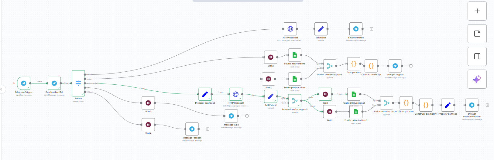

# 🤖 n8n Agro Telegram Bot

---

## 🌿 Description

**n8n Agro Telegram Bot** est un assistant intelligent conçu par **Sterve** pour automatiser la gestion des fermes agricoles.  
Il combine la puissance de **n8n**, **Telegram**, **Google Sheets** et **Open-Meteo API** pour fournir des rapports quotidiens, des recommandations météorologiques et des analyses précises sur les activités agricoles.

Ce projet s’inscrit dans la vision de **l’agriculture intelligente en Afrique**, où l’automatisation et l’intelligence artificielle deviennent des leviers de productivité et de durabilité.

 

---

## ⚙️ Fonctionnalités principales

- 🔄 **Connexion automatique à Open-Meteo API** pour obtenir les données météo locales.  
- 🧾 **Lecture intelligente des feuilles Google Sheets** pour extraire les interventions et pulvérisations.  
- 🤖 **Analyse JavaScript intégrée** pour produire des recommandations météo et agricoles.  
- 💬 **Bot Telegram interactif** :  
  - `/meteo` → Météo du jour ☀️🌧️  
  - `/rapport` → Rapport des activités de la veille 📊  
  - `/recommandation` → Conseils IA et bonnes pratiques 🌿  
  - `/aide` → Menu d’aide 📘  
- 🧱 **Structure modulaire prête à l’extension IA (ChatGPT API, automatisations futures)**.

---

## 🧰 Technologies utilisées

| Outil / API | Rôle principal |
|--------------|----------------|
| **n8n** | Moteur d’automatisation |
| **Telegram Bot API** | Interface conversationnelle |
| **Open Meteo API** | Données météorologiques |
| **Google Sheets** | Base de données agricole |
| **JavaScript (n8n Code Node)** | Analyse et logique IA |

---

## 🚀 Installation

### 🧩 Importer le workflow dans n8n

1. Ouvre ton instance **n8n**.  
2. Clique sur **Import Workflow**.  
3. Choisis le fichier `.json` du dossier `workflows/`.

---

### 🔐 Configurer les credentials nécessaires

- **Telegram account** → Ton *Bot Token*.  
- **google-agro** → Authentification Google Sheets.  
- **Open-Meteo** → Aucun token requis.

---

### ⚙️ Lancer le bot

1. Démarre ton workflow dans **n8n**.  
2. Envoie la commande `/aide` sur **Telegram** pour tester la communication.

---

## 📸 Exemple d'utilisation

Une fois le bot configuré :
> 👩‍🌾 `/meteo` → renvoie la météo du jour avec un conseil IA personnalisé.  
> 🧾 `/rapport` → compile les données Google Sheets de la veille.  
> 🌧️ `/recommandation` → analyse météo + conseils pour la journée.

---

## 🌍 Vision de Sterve

> *“L’automatisation est la clé pour redonner de la valeur au travail agricole en Afrique.  
Avec des outils comme n8n et Telegram, chaque ferme peut devenir intelligente, connectée et rentable.”*

---

## 🧩 Structure du projet

📂 n8n-agro-telegram-bot
┣ 📂 workflows/ → Fichiers JSON d’automatisation n8n
┣ 📂 docs/ → Documentation technique
┣ 📄 .gitignore → Fichiers à exclure du suivi Git
┣ 📄 LICENSE → Licence MIT
┗ 📄 README.md → Présentation officielle du projet

---

## 📜 Licence

Distribué sous licence **MIT**.  
Voir le fichier [LICENSE](./LICENSE) pour plus d’informations.

---

### 💡 Crédits

Créé par **Sterve** — Entrepreneur digital et concepteur d’agents IA.  
📬 Contact : [Telegram](https://t.me/) | [GitHub](https://github.com/sterve9)  
🧠 Propulsé par **n8n**, **IA**, et la passion pour l’innovation agricole.
